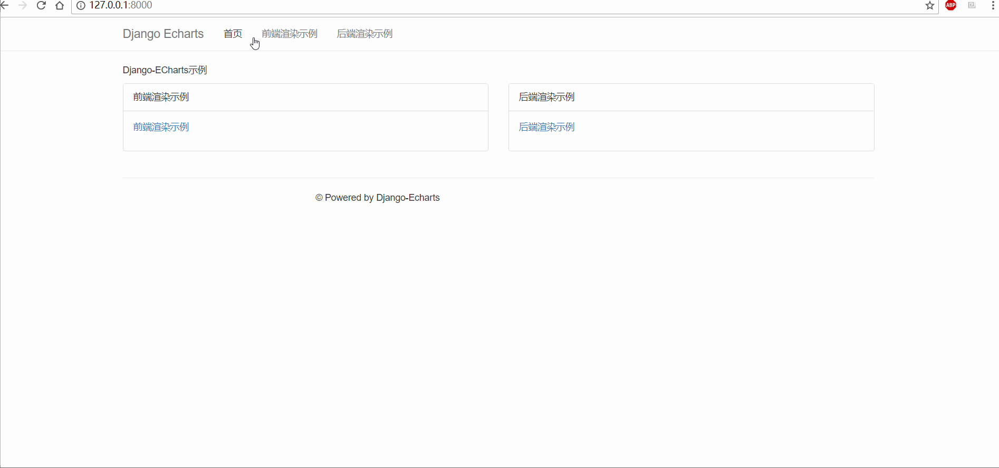

# django-echarts

   

A intergration for [Echarts](http://echarts.baidu.com/index.html) and [Django](https://www.djangoproject.com) based on [chenjiandongx/pyecharts](https://github.com/chenjiandongx/pyecharts) .

> This project is on the developement state, do not use in the production environment.

## Overview

django-echarts provides a set of shortcut tool for django intergration.These are:

- Simple data builder for echarts
- Renders using frontend ajax or templates
- Javascript host manager
- Some utils functions and classes

django-echarts covers the following django components.You should understand them before using django-echarts.

- View mixin
- template tags
- context processors
- Management commands

django-echarts works on Python2.7 / Python3.5+ and Django1.8+,and Python3 is **Strongly** recommended.

## Installation

You can install *django-echarts* from pip.

```
pip install django-echarts
```

or build from source code.

```
git clone https://github.com/kinegratii/django-echarts.git
cd django-echarts
python setup.py install
```

## Setup

1 Add django_charts app to your `INSTALL_APPS`.

```python
INSTALL_APPS = (
    # Your apps
    'django_echarts'
    # Your apps
)
```

2 Custom your settings with `DJANGO_ECHARTS` variable in the settings module.e.g

```python
DJANGO_ECHARTS = {
    'lib_js_host':'cdnjs'
}
```

Or you my not define the variable and use all default values.

Read *API* document to see more details.

3 Add view class for a render way.

Frontend Render

```python
def create_simple_bar():
    bar = Bar("我的第一个图表", "这里是副标题")
    bar.add("服装", ["衬衫", "羊毛衫", "雪纺衫", "裤子", "高跟鞋", "袜子"], [5, 20, 36, 10, 75, 90])
    return bar


class SimpleBarView(EChartsFrontView):
    def get_echarts_instance(self, **kwargs):
        return create_simple_bar()
      
```

Backend Render

```python
 class BackendEChartsTemplate(EChartsBackendView):
    template_name = 'backend_charts.html'

    def get_echarts_instance(self, *args, **kwargs):
        return create_simple_bar()
```

4 Add template tag file, where you can use some custom template tags.

```html




    <div class="row row-offcanvas row-offcanvas-right">
        <div class="col-xs-6 col-sm-2 sidebar-offcanvas" id="sidebar">
            <div class="list-group">
                <a href="?name=bar" class="list-group-item">柱形图(Bar)</a>
                <a href="?name=kine" class="list-group-item">K线图(KLine)</a>
                <a href="?name=map" class="list-group-item">地图(Map)</a>
                <a href="?name=pie" class="list-group-item">饼图(Pie)</a>
            </div>
        </div>
        <!--/.sidebar-offcanvas-->
        <div class="col-xs-12 col-sm-10">
            <p class="pull-right visible-xs">
                <button type="button" class="btn btn-primary btn-xs" data-toggle="offcanvas">Toggle nav</button>
            </p>
            {# 渲染容器 #}
            

        </div>
        <!--/.col-xs-12.col-sm-9-->
    </div>




    {# 渲染依赖文件 #}
     
    {# 渲染初始化文本 #}
    

```

## Document

- [English Document](docs/us-en/api.md)
- [中文文档](docs/zh-cn/api.md)

## Example

The example project is under *example* directory.

```shell
cd example
python manage.py runserver 127.0.0.1:8000
```

Access the web url  http://127.0.0.1:8000 , the screencut is the following picture.



## License

The project is under the MIT license, Issues & Pull requests are welcome.